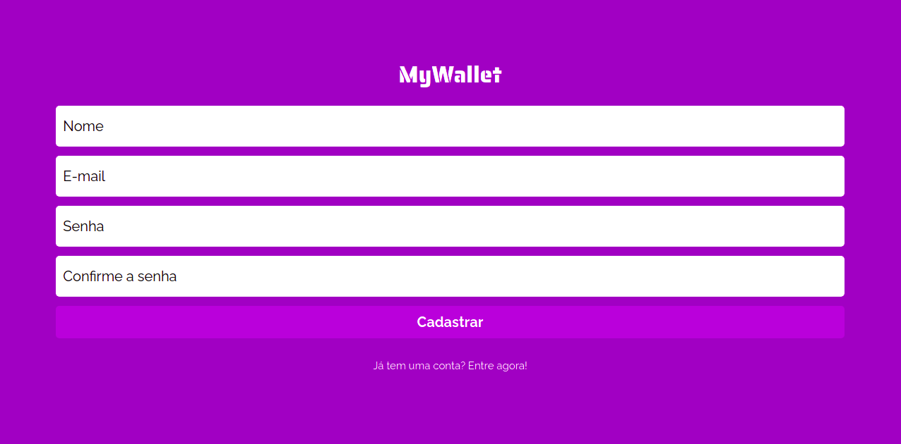
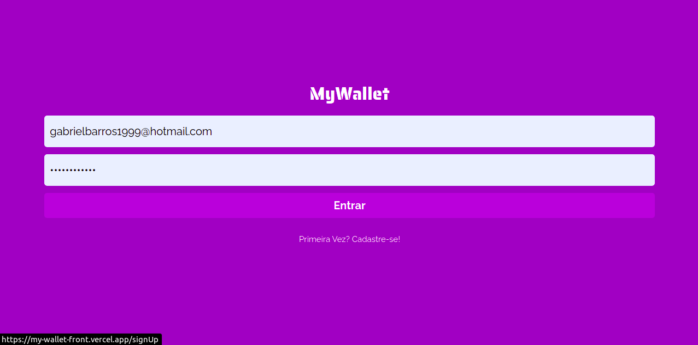
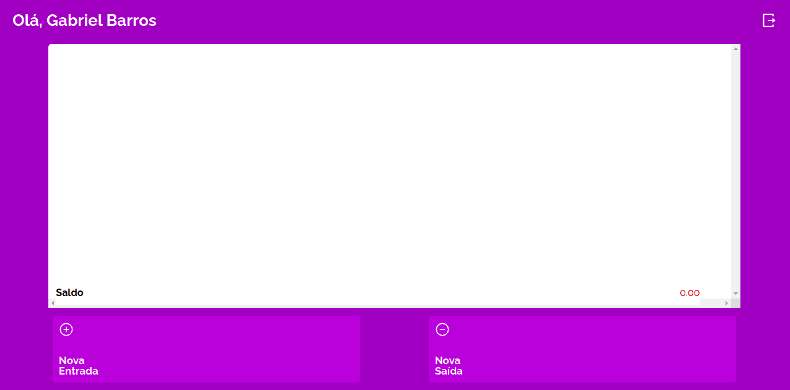
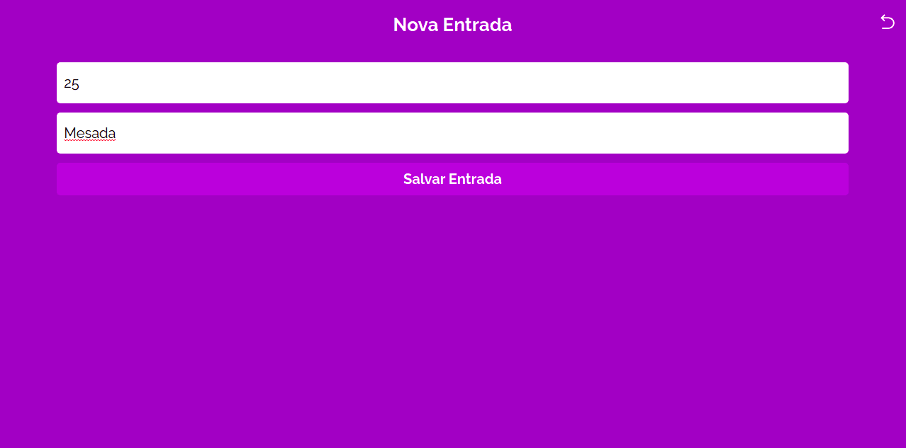
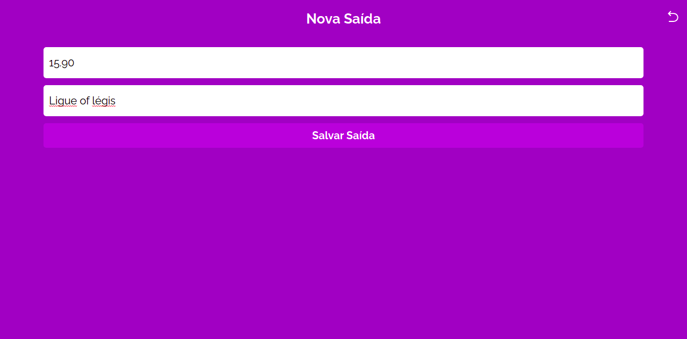

# My Wallet

My Wallet, um app **React** onde você se cadastra e loga para poder manter controle da sua carteira 

DEMO: https://my-wallet-front.vercel.app/

## Features

✅ Cadastro / Login

✅ Adicionar Entrada/Saída de dinheiro

✅ Mostrar o extrato e o saldo atual












## Como rodar o projeto?

1. Instale o NodeJS [https://nodejs.org/en/](https://nodejs.org/en/)
2. Clone o projeto
3. Instale as dependências

    ```bash
    npm i
    ```

4. Rode a aplicação 🙂

    ```bash
    npm run start
    ```
